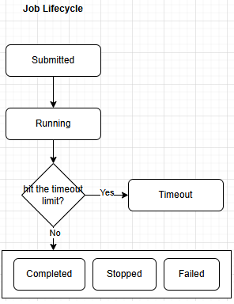
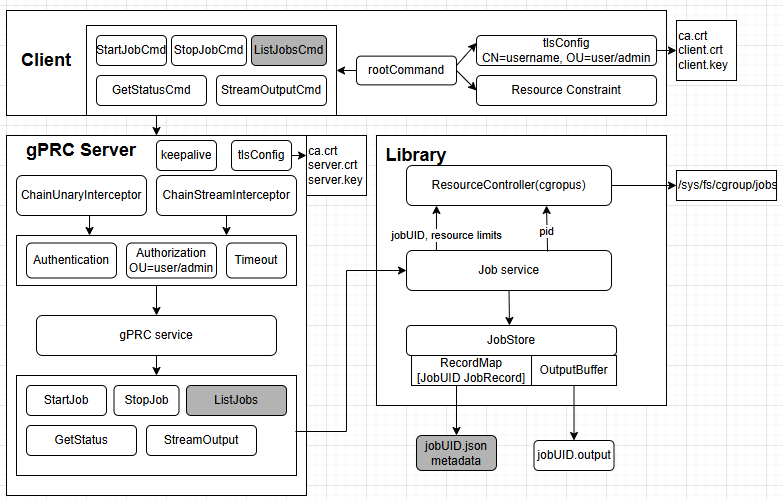

# The Overall Design of Teleleport Challenge 1
## Summary
It is a prototype job worker service designed based on the requirements at https://github.com/gravitational/careers/blob/main/challenges/systems/challenge-1.md. 
## Job
### Definition
The service provides an API for running arbitrary Linux processes. These processes can be any executable programs available on the machine hosting the service. The API supports specifying commands, arguments, and environment variables.

To support job status queries, each job is assigned a unique ID (UID). Resource controls for CPU, memory, and disk I/O are implemented per job using cgroups v2, as requested.

There are also some implicit requirements, such as maintaining job status information for querying and supporting role-based access control for authorization (using CN for user and OU for role as a simple approach). Request timeouts are hardcoded on the gRPC server side.
```golang
type JobSpec struct {
    UID       string
    Command   string
    Args      []string
    Resources map[string]string
    ProcessID int
    Status    JobStatus
    Username  string
    StartTime timestamp
    EndTime   timestamp
}
const (
	Running   JobStatus = iota
	Completed          // process exited 0
	Stopped            // killed via Stop()
	Failed             // process exited non-zero
	Timeout            
    Unknown
)
```
### Lifecycle
The following diagram illustrates the details of job status. If a job does not exist, unknown is returned by default.

 
## Component Architecture
There are three major components: the client, the gRPC server, and the library, as shown below. The greyed-out ones are optional.
 

## Client
Cobra is integrated to create a root command that supports four subcommands: startJobCmd, stopJobCmd, queryStatusCmd, and streamOutputCmd, with an optional listJobsCmd.

Since we use mTLS authentication, client certificates are verified. These certificates are required to configure and execute the client commands.

The certificates contain the CN (Common Name) field as the username and the OU (Organizational Unit) field as the role for authorization purposes. The server validates these fields against the access control list (ACL), which supports two roles: user and admin.

We also added resource control as described above. Resource flags are provided as key-value pairs, for example: --resource cpu=1 --resource memory=30m. The current implementation supports cpu (number of CPU cores), memory (memory.max as the memory limit), io.read (disk read throughput limit), and io.write (disk write throughput limit).

Each request might have a timeout. However, for simplicity, the timeout is currently hard-coded in the gRPC server.

### Start Job
```
client start \
  --server [ip:port] \
  --cert client.crt \
  --key client.key \
  --ca ca.crt \
  --command /usr/bin/python  \
  --arg -m --arg 8080 \
  --resource cpu=1 --resource memory=30m --resource io.read=10mb --resource io.write=5mb
 ```
### Stop Job
 ```
client stop \
  --server [ip:port] \
  --cert client.crt \
  --key client.key \
  --ca ca.crt \
  --id  cb056f6e-1643-44d3-9f64-11688bc562c4
 ```

 ### Query Status
 ```
client status \
  --server [ip:port] \
  --cert client.crt \
  --key client.key \
  --ca ca.crt \
  --id  cb056f6e-1643-44d3-9f64-11688bc562c4
 ```

  ### Stream output
 ```
client output \
  --server [ip:port] \
  --cert client.crt \
  --key client.key \
  --ca ca.crt \
  --id  cb056f6e-1643-44d3-9f64-11688bc562c4
 ```

   ### (Optional) List jobs
 ```
client list \
  --server [ip:port] \
  --cert client.crt \
  --key client.key \
  --ca ca.crt 
 ```

## gPRC Server
Following the commands above, the service proto is defined below. ListJobs is added for testing purposes. One concern is that output streaming might return large payloads. In the future, I may replace bytes with BinaryChunk to support chunked streaming. For now, we use a simpler solution to get the system functional first.
 ```
service JobService {

  // A job is created and return a job UID
  rpc StartJob(StartJobRequest) returns (StartJobResponse);

  // Return whether the job is stopped or not
  rpc StopJob(StopJobRequest) returns (StopJobResponse);

  rpc GetStatus(GetStatusRequest) returns (GetStatusResponse);

  // Streaming output (non-blocking)
  rpc StreamOutput(StreamOutputRequest) returns (stream StreamOutputResponse);

  // Optional for testing
  rpc ListJobs(ListJobsRequest) returns (ListJobsResponse);
}

enum JobStatus {
  JOB_STATUS_UNKNOWN = 0;
  JOB_STATUS_RUNNING = 1;
  JOB_STATUS_STOPPED = 2;
  JOB_STATUS_FAILED = 3;
  JOB_STATUS_COMPLETED = 4;
}

message StartJobRequest {
  string command = 1;
  repeated string args = 2;
  map<string, string> resources = 3;
}
message StartJobResponse {
  string job_id = 1;
  JobStatus job_status = 2;
  google.protobuf.Timestamp start_time = 3;
  google.protobuf.Timestamp end_time = 4;
  string message = 5;
}

message StopJobRequest {
  string job_id = 1;
}
message StopJobResponse {
  string job_id = 1;
  bool stopped = 2;
  JobStatus job_status = 3;
  string message = 4;
}

message GetStatusRequest {
  string job_id = 1;
}
message GetStatusResponse {
  string job_id = 1;
  JobStatus status = 2;
  string message = 3;
}

message StreamOutputRequest {
  string job_id = 1;
}
message StreamOutputResponse {
  string job_uid = 1;
  bytes payload = 2; // I’m concerned that the payload might be large
  string message = 3;
}

message ListJobsRequest {}
message ListJobsResponse {
  repeated JobInfo jobs = 1;
  string messages = 2;
}
message JobInfo {
  string job_id = 1;
  string username = 2;
  string command = 3;
  repeated string args = 4;
  map<string, string> resources = 5;
  JobStatus job_status = 6;
  google.protobuf.Timestamp start_time = 7;
  google.protobuf.Timestamp end_time = 8;
}

 ```
As shown in the architecture, an authentication interceptor and an authorization interceptor are placed before the job service to ensure security. We also assume that certificates need to be rotated over time. For simplicity, we currently hardcode the expiration time.

## Library
### Resource Control
It is implemented using cgroups v2. When a job starts, its resource limits are applied by creating a cgroup named after its jobUID. A command is constructed from the job’s command and argument attributes. After the command is created, the process ID (PID) and any child process IDs are added to cgroup.procs (use SIGSTOP and resume with SIGCONT to get child processes for race condition concerns).

When a stop job request is received, all processes in cgroup.procs are killed, and the corresponding cgroup files are removed.

### Metadata
A job store is created with an in-memory map where the key is the jobUID and the value is the job’s metadata. This is used for querying job status. In addition, each job record is persisted to disk as a JSON file for crash recovery or testing, which might be optional.
 ```
type JobRecord struct {
	JobID     string    `json:"job_id"`
	Command    string    `json:"command"`
	Args       []string  `json:"args"`
    Resources  []string  `json:"resources"`
	Status     string    `json:"status"`
	PID        int       `json:"pid"`
	ExitCode   int       `json:"exit_code"`
	StartTime  time.Time `json:"start_time"`
	EndTime    time.Time `json:"end_time,omitempty"`
	Error      string    `json:"error,omitempty"`
	OutputPath string    `json:"output_path"` 
}
type JobStore struct {
	mu      sync.RWMutex //For reading and writing the job record map
	records map[string]*JobRecord
}
 ```
### Output

A thread-safe OutputBuffer is created to support writing and streaming output, balancing memory usage and performance.
 ```
type OutputBuffer struct {
	file   *os.File
	writer *bufio.Writer
	reader *bufio.Reader
	mu     sync.Mutex
}
 ```

## Testing
### Job Lifecycle
Start a job → get job status → stop the job → stream its output -> list all the jobs
Start a job → stop the job → get job status → stream its output -> list all the jobs
Start a job → stream its output until completion -> list all the jobs
Start multiple jobs → stream their outputs -> list all the jobs
Start multiple jobs → stop a job randomly → get job status → stream their outputs -> list all the jobs
Start multiple jobs → stream their outputs → stop a job randomly -> list all the jobs
### Authenication
Access gRPC server without certificates
Access gRPC server with invalid certificates
Access gRPC server with valid certificates
### Authorization
Access own jobs
Access other jobs using user role
Access other jobs using admin role
### Resource controls
Start a job when insufficient resources are available
Pass valid resource limits → check if new jobs are running
Run jobs → check for resource leaks 